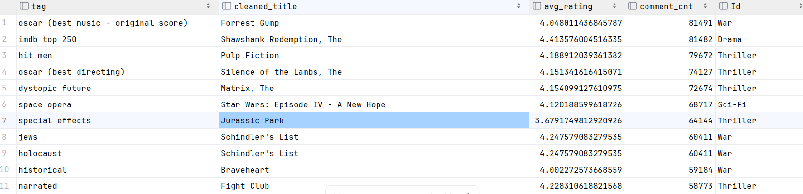

## 3. Data Collection and Preparation

### Dataset Selection

For our data selection, we chose the MovieLens 25M Dataset from GroupLens.  
This dataset contains 25,000,095 ratings and 1,093,360 tag annotations from 162,541 users on 62,423 movies, spanning from January 9, 1995, to November 21, 2019.  
Users were randomly selected, with each having rated at least 20 movies, and no demographic information is included.  
The dataset is stored in CSV format and encoded in UTF-8.  

The dataset includes the following files [1]:  
- **Movies Data File (movies.csv)**: Contains movie IDs, titles, and genres.  
- **Ratings Data File (ratings.csv)**: Contains user ratings for movies at specific timestamps.  
- **Tags Data File (tags.csv)**: Contains user-assigned tags for movies at specific timestamps.  
- **Links Data File (links.csv)**: Provides IMDb links for each movie.  
- **Tag Genome (genome-scores.csv and genome-tags.csv)**: Contains tag relevance scores generated using machine learning techniques [2].  

Compared to IMDB [3] and other movie datasets on Kaggle, we selected this dataset for the following reasons:  
- **Simplified data structure**: The dataset primarily consists of movie IDs, user IDs, and tag IDs, making it easy to import into a database or use with NetworkX, as there are fewer attributes for each entity.  
- **Large-scale and extensive coverage**: In addition to movie metadata and tags, it includes ratings from 162,541 users spanning from 1995 to 2019. Unlike IMDB, this dataset contains user-level rating data, allowing us to analyze user communities using NetworkX.  
- **Temporal data availability**: The dataset includes timestamps for ratings and tags. This allows us to analyze trends over time. For example, *The Big Lebowski* (1998) initially received little attention but became a *cult classic* after 2000 due to DVD and VHS releases [5]. We can study this trend through user rating timestamps.  

### Dataset Acquisition  

All data is available online and can be downloaded directly via a browser. After extracting the dataset, the following files are available:  

```text
-a----   2025/3/16   20:57   435164157 genome-scores.csv
-a----   2025/3/16   20:57      18103 genome-tags.csv
-a----   2025/3/16   20:57    1368578 links.csv
-a----   2025/3/16   20:57    3038099 movies.csv
-a----   2025/3/16   20:57  678260987 ratings.csv
-a----   2025/3/16   20:57      10460 README.txt
-a----   2025/3/16   20:57   38810332 tags.csv
```

A preliminary observation reveals that **ratings.csv** is the largest file (646MB), while **movies.csv** and **tags.csv** are much smaller (under 50MB). These three files are the primary data sources for our analysis.  

For this small, pre-processed dataset, downloading and extracting it locally or on a server is sufficient.  

However, in enterprise-level data collection, datasets are not always readily available. Web scraping tools like **Scrapy** can be used to collect data from specific websites [6], but privacy and copyright considerations must be taken into account. The collected data can be stored on a server or an object storage system for further cleaning and processing.  

### Data Storage and Import  

Before performing analysis, we need to import the data into MySQL. Following the **data warehouse layering concept** [4], we can store the raw CSV data in the **ODS (Operational Data Store) layer**. After preliminary cleaning, we can proceed with further analysis.  

Using a GUI tool like **DataGrip**, we can import the dataset into MySQL. To prevent errors during import, we initially set all columns to **VARCHAR(512)**, deferring precise data type assignments until later processing.  

In enterprise-level data warehouses or data platforms, data collection is significantly more complex. Typically, analysis is performed on data stored in HDFS-based data warehouses or modern data lakes like Iceberg or Hudi, with raw data originating from MySQL or other sources. Common data ingestion strategies include:  

- **Batch ingestion**:  
  - Using **Sqoop** or **Flume** to import data from MySQL to **HDFS/Hive** daily, either in full or as incremental updates.  
- **Real-time data synchronization**:  
  - Reading **MySQL binlogs** and using **Change Data Capture (CDC)** tools like **Flink CDC, Debezium, or Canal** to synchronize data into a data lake for analysis.  


### Data Preprocessing and Cleaning  
In this step, we mainly focus on data cleaning
In the `ods_grouplens_movies` table, the release year of the movies is included in the title field. We need to extract the year into a separate column to facilitate subsequent queries and analysis. Note that some movie titles contain the year, while others do not. We need to handle these cases separately.
The following is the SQL code: 
```sql

create table dwd.movies as
select
    m.movieId,
    m.title as uncleaned_title,
    case when m.title REGEXP '\\([0-9]{4}\\)$'
        then trim(replace(m.title,RIGHT(m.title, 6),''))
    else m.title
        end as cleaned_title,
    case when m.title REGEXP '\\([0-9]{4}\\)$'
        then replace(replace(RIGHT(m.title, 6),'(',''),')','')
        else '-1'
        end as year
from ods.ods_grouplens_movies m
```

In the `ods_grouplens_movies` table, the `genres` field is separated by the "|" character. A single movie may have multiple genre types. To better analyze the data from the genre dimension in the future, we need to split the data in this column by the "|" string and then expand the data into multiple rows. 
```sql


create table dwd.movies_genres
SELECT
    a.movieId,
    substring_index(substring_index(a.genres,'_',b.help_topic_id + 1    ),    '|' ,- 1    ) AS ID
from
(select
    m.movieId,
    genres
    from ods.ods_grouplens_movies m
    ) a
JOIN mysql.help_topic b ON b.help_topic_id <
(length(a.genres) - length( replace(a.genres, '|', '')  ) + 1)

```
Then, we process the `ods.ods_grouplens_genome_scores` table. The problem with this table is that it has a large amount of data, with 15,584,448 rows. In fact, only 13,816 movies have tags, and on average, each movie has 1,128 tags. When conducting analysis, SQL joins are time - consuming due to the large amount of data. We only select the tags with the maximum relevance for each movie. 
```sql
-- 13894 size. 
create table dwd.movie_max_tags as
select
    r.movieId,r.tagId,o.max_relevance
from ods.ods_grouplens_genome_scores r
inner join
(
    select movieId,max(r.relevance) as max_relevance
from  ods.ods_grouplens_genome_scores r
group by r.movieId
) o on r.movieId = o.movieId and r.relevance = o.max_relevance

```
```sql


create table dwd.user_tag_movie as
SELECT
     r.*,
     DATE_FORMAT(FROM_UNIXTIME(timestamp ), '%Y-%m-%d %H:%i:%s') as comment_time
from ods.ods_grouplens_tags r;

create table dwd.user_rate_movie
select
    r.*,
    DATE_FORMAT(FROM_UNIXTIME(timestamp ), '%Y-%m-%d %H:%i:%s') as comment_time

from ods.ods_grouplens_ratings r;


create table dwd.tags as     
select * from ods.ods_grouplens_genome_tags;


```

## 4. MySQL-Based Data Analysis 

### 
The classifications of movies in the past five years are as follows.
```sql

select
    g.Id,count(1)
from dwd.movies m
left join dwd.movies_genres g on m.movieId = g.movieId
where m.year > 2015
group by g.ID

having count(1) > 1000
order by count(1) desc;
```

Thriller,3031
Drama,2646
Comedy,1283
Romance,1246
Documentary,1080

Due to the large number of comments, select movies with more than 1000 reviewers.
```sql

create table dwd.tmp_movie_avg_rate
select u.movieId,count(1) as comment_cnt,avg(u.rating) from dwd.user_rate_movie u
group by u.movieId;

create table dwd.tmp_movie_avg_rate_above_1000 as
select distinct t.movieId,t.avg_rating,t.comment_cnt,
       m.cleaned_title,m.year,g.ID,mt.tagId,mt.max_relevance
from dwd.tmp_movie_avg_rate t
left join dwd.movies m on t.movieId = m.movieId
left join dwd.movies_genres g on t.movieId = g.movieId
left join dwd.movie_max_tags mt on t.movieId = mt.movieId
where t.comment_cnt > 1000
order by t.avg_rating desc
;
```

The movie with the highest user rating:
```sql

select t.tag,a.cleaned_title,a.avg_rating,a.comment_cnt,a.Id from dwd.tmp_movie_avg_rate_above_1000 a
         left join dwd.tags t on a.tagId = t.tagId
order by avg_rating desc;
```


The movies with the highest user ratings:
```sql
select t.tag,a.cleaned_title,a.avg_rating,a.comment_cnt,a.Id from dwd.tmp_movie_avg_rate_above_1000 a
         left join dwd.tags t on a.tagId = t.tagId
order by comment_cnt desc;
```


The movie genre with the highest user ratings
```sql
select b.ID,
       count(1) as number_of_movies,avg(avg_rating) as rating_avg,sum(a.comment_cnt) as comment_count
from dwd.tmp_movie_avg_rate_above_1000 a

left join dwd.movies_genres b on a.movieId = b.movieId
group by b.ID
order by rating_avg desc
```

###
Movie：Big Lebowski, The
```sql

create table dwd.tmp_user_rating_analysis_big_lebowski
    select
    m.cleaned_title,
    m.year,
    u.userId,
    u.rating,
    u.comment_time
from dwd.movies m
inner join dwd.user_rate_movie u
on m.movieId = u.movieId
where m.cleaned_title = 'Big Lebowski, The'
;

create table dwd.tmp_user_taging_analysis_big_lebowski

select
    m.cleaned_title,
    m.year,
    u.userId,
    u.tag,
    u.comment_time
from dwd.movies m
inner join dwd.user_tag_movie u
on m.movieId = u.movieId
where m.cleaned_title = 'Big Lebowski, The'


```

```sql
-- r1
SELECT
    SUBSTRING(comment_time, 1, 4) AS year,
    COUNT(*) AS comment_count,
    -- 计算评分的平均值，先将rating转换为数值类型再计算
    AVG(
             rating + 0
        ) AS average_rating
FROM
    dwd.tmp_user_rating_analysis_big_lebowski
GROUP BY
    -- 按年份分组
    SUBSTRING(comment_time, 1, 4);
```
The graph of r1 is shown below. We can observe that after the movie was released in 1998, the number of comments surged between 2004 and 2006, as well as between 2015 and 2018.

From the graph of r2, we can see that when the movie was released in 1998, its rating was around 3.5. The movie became popular again in 2002. Between 2002 and 2005, the movie's score started to reach 4, and it peaked in 2005.


According to Wikipedia, in 2002, the movie experienced a mysterious resurgence in popularity. Many enthusiastic fans promoted the movie everywhere, just like the protagonist in the movie.
It is worth noting that the movie studio released a "Collector's Edition" DVD in 2005 and a 4K Ultra HD Blu - ray version of the film in 2018. The reason might be that they noticed this phenomenon. 


## 5. NetworkX-Based User-Movie Relationship Network Analysis  

### References  

[1]: [MovieLens 25M Dataset README](https://files.grouplens.org/datasets/movielens/ml-25m-README.html)  
[2]: [Tag Genome Research Paper](https://dl.acm.org/doi/10.1145/2362394.2362395)  
[3]: [IMDB Non-Commercial Datasets](https://developer.imdb.com/non-commercial-datasets/)  
[4]: [Data Warehouse Architecture Types](https://acuto.io/blog/data-warehouse-architecture-types/)  
[5]: [The Big Lebowski's Cult Status](https://relevantmagazine.com/culture/20-years-big-lebowski-still-abides/)  
[6]: [Scrapy Web Scraping Framework](https://scrapy.org/)  

F. Maxwell Harper & Joseph A. Konstan. *The MovieLens Datasets: History and Context.* ACM Transactions on Interactive Intelligent Systems (TiiS), 5(4), 19:1–19:19, 2015.  
[DOI: 10.1145/2827872](https://doi.org/10.1145/2827872)  
[MovieLens Dataset README](https://files.grouplens.org/datasets/movielens/ml-25m-README.html)  
[Tag Genome Paper](https://files.grouplens.org/papers/tag_genome.pdf)  